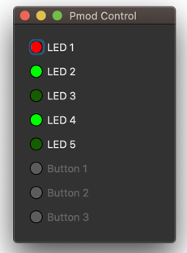
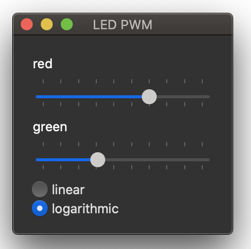
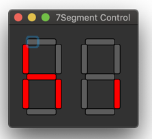
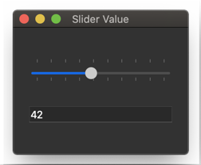
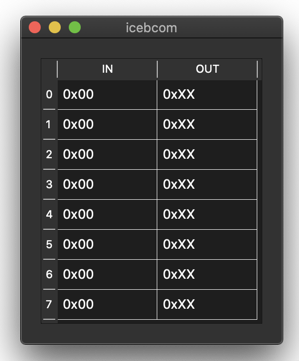

# iCEBcom

This project provides modules for a simple communication between the host computer and the iCBreaker FPGA. The communication is realized with 1,2,4 or 8 input and output bytes. Furthermore, there are python GUIs to control the data on the host side.

## Getting Started

Prerequisit:

* install the icestorm toolchain
* install python3 with pyserial and PyQt5

Start the first example by executing the following commands

`cd Pmod\ 5LED\ 3Buttons/`

`make prog`

`python3 pmod_ledbtn1.py`

The second example allows you to control the brightness of the red and green LEDs with sliders. If you want run it, change the first line of the Makefile and replace the `1` with a `2`. Then run `make prog` and `python3 pmod_ledbtn2.py`.

## 7 Segment Display

The first example lets you control every segment of the display individually. Make sure that the 7 segment display is connected to Pmod 1A. Then use `make prog` and `python3 pmod_7seg1.py`.

The second example maps a slider to a display value from 0 to 99. As in the previous case, change the first line of the Makefile to run the second example.

## templates

The templates folder contains examples that serve as examples on how to use the modules. In this templates the input is directly connected to the output. The folder also contains a python GUI, that allows to control all inputs and outputs in hex format.

## com folder

This folder contains the communication modules. Note that you can not build these modules. However, you can run the simulation with `make sim`.
