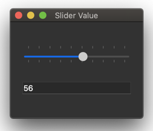

# iCEBcom

## Getting Started

prerequisit

* install the icestorm toolchain
* install python3 with pyserial and PyQt5 

`cd Pmod\ 5LED\ 3Buttons/`

`make prog`

`python3 pmod_ledbtn1.py`

## 7 Segment Display

